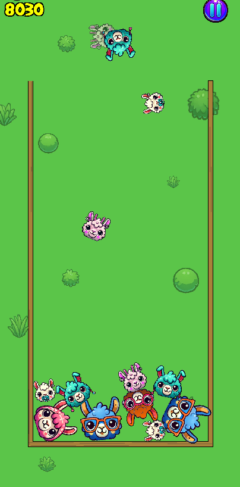

# Stacky Llamas

**Stacky Llamas** is a lighthearted 2D merge-puzzle prototype about combining matching objects.

## Highlights
- Merge-based puzzle mechanics.
- Progression with saved local state.
- Sound feedback for interactions.

## Development
- **Engine:** Unity 6000.0.59f2
- **Status:** Complete

## Run locally
1. Clone the repository.
2. Open it in Unity Hub with the listed Unity version.
3. Open a scene in `Assets/Scenes` and press Play.
