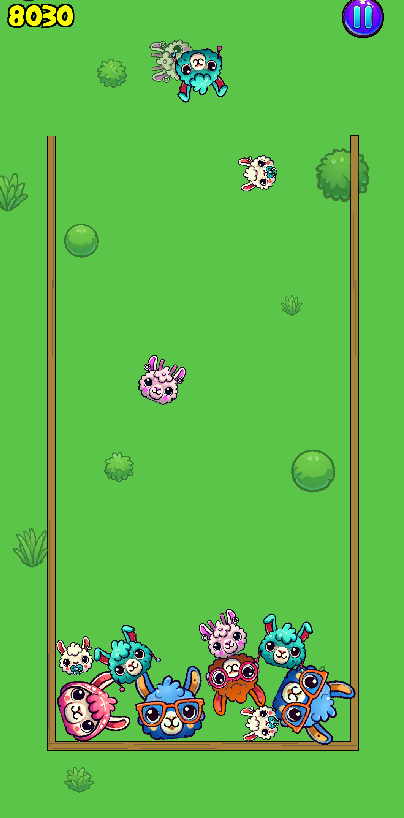

# Stacky Llamas

  

<strong>A lighthearted 2D merge puzzle about combining matching objects.</strong>

  
  
  

## About

**Stacky Llamas** is a compact puzzle game that turns matching and combining objects into a relaxed score-driven loop.

## Highlights

- **Merge-based core:** Combine matching objects to progress.
- **Saved preferences:** Best score and sound setting persist between sessions; the current board is not saved.
- **Responsive feedback:** Sound reinforces each interaction.

## Technical details

- **Engine:** Unity `6000.3.15f1`
- **Status:** Complete

## Run locally

1. Clone the repository.
2. Open it in Unity Hub with Unity `6000.3.15f1`.
3. Open a scene in `Assets/Scenes` and press Play.

## Gameplay rules

- Matching llamas merge into the next level. Two level-16 llamas disappear with points and an effect.
- Each merge awards `level * 10` base points. A chain of N merges within the configured `GameManager.maxComboTime` window of each other is worth N times the chain's base points. The bonus is paid when the combo expires or the run ends.
- Merge points float upwards at the merge position. A shrinking bar below the combo multiplier shows the remaining window, and the pending bonus is displayed separately. Longer chains boost the existing particle effect (capped at x6 intensity).
- Dropping stays fast: new previews keep the configured spawn delay. Fresh drops can merge only after falling one collider diameter below their release height; continuing contacts retry automatically.
- Pause freezes physics, spawn/activation timers, point popups and the combo. The preview stays inactive when resuming.
- Returning from another app or a locked screen leaves the pause menu open; resume explicitly.
- Restart clears the board and all pending actions. Best scores are also preserved on restart, exit and app suspension.

## Editing the feedback UI

The feedback is authored in `Ingame`, under `Canvas/SafeArea`: `txtComboCounter` contains `ComboTimer/RemainingTime` and `PendingComboBonus`. `MergePoints` contains 12 reusable instances of `Assets/Prefabs/MergePointsPopup.prefab`. Edit their layout, font and base colors in the scene or prefab; `MergeFeedback` on `SafeArea` exposes animation settings and scene references. No UI objects are created or reparented at runtime, and the combo position/anchors are preserved. The timer updates its Image fill amount without changing its RectTransform. Only floating point popups move and scale. Automatic display safe-area adaptation is disabled by default; opt in with Apply Device Safe Area on the SafeArea component if needed. Authored offsets are preserved even when opting in.

## Verification

The signed APK/AAB workflow, local checks and update revision are documented in [Android release workflow](docs/AndroidRelease.md). The included GitHub checks perform offline tests only; builds and uploads require explicit local commands.

Run `StackyLlamas.PlayModeTests` in Unity's Test Runner (PlayMode). The tests load the actual `Ingame` scene and restore the existing best-score/sound preferences afterwards.

Before uploading an Android update, test on a device:

- Pause/resume before the first drop and immediately after a drop; the preview must never fall by itself.
- Restart rapidly, including during spawn delays; no old objects may reappear.
- Lock/unlock the screen and switch apps; physics must stay paused until Resume.
- Check touch gestures, tilt controls, notches/navigation bars and multiple screen ratios.
- Run a longer session with many merges/restarts and check the Profiler and device logs.

The target Android SDK is selected automatically by Unity. Verify the resulting bundle's target SDK and signing/version code before publishing. The existing `BestScore` and `SoundOnOff` preference keys are retained for installed users.
